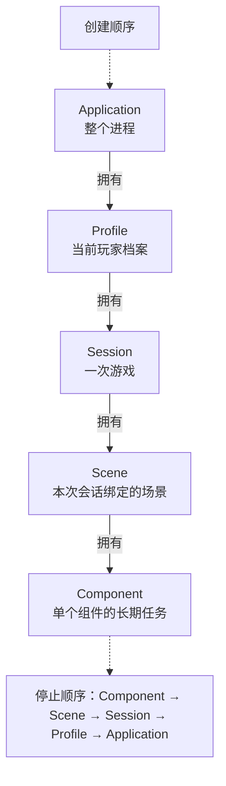
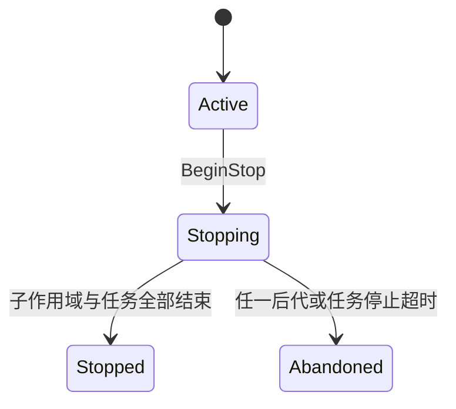
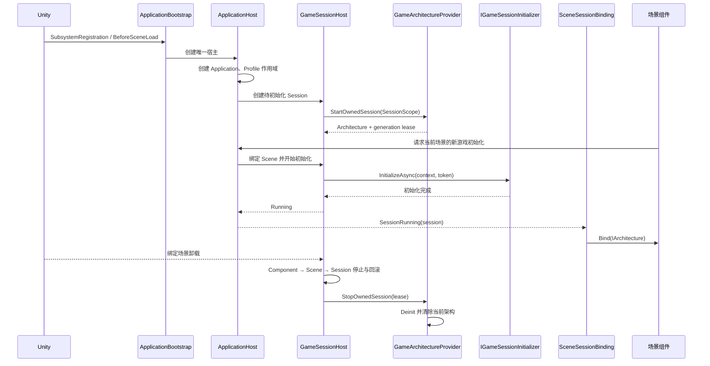
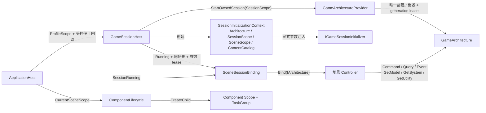

# 应用生命周期与会话作用域

> 状态：`alpha 0.2.0` 已完成；最近更新：2026-08-18
>
> 参考：[归档计划](../plan/archive/alpha-0.2.0-application-lifecycle-plan.md) · [基础设施约束契约](../plan/alpha-0.2-infrastructure-contract.md)

## 核心模型

生命周期系统只回答三个问题：**谁创建、依赖怎样交付、谁负责停止**。

可以把它理解成一组串联的总闸：父作用域拥有子作用域，父作用域断电时会向下取消所有子作用域；清理则从最末端开始，逐层等待任务结束后再回收上层资源。

创建从上到下，停止从下到上。短生命周期可以使用长生命周期依赖；长生命周期不得保留已经结束的场景或组件引用。作用域只管理取消、任务等待和父子所有权，不是依赖注入容器。

## 各层作用域

| 作用域 | 所有者 | 主要内容 | 结束时机 |
| --- | --- | --- | --- |
| Application | `ApplicationHost` | 应用状态、场景请求协调、根取消 | 应用退出或测试清理 |
| Profile | `ApplicationHost` | 当前档案的生命周期位置 | 应用退出；正式档案切换尚未实现 |
| Session | `GameSessionHost` | `GameArchitecture`、玩法 Model / System、随机状态、运行时对象 | 离开当前游戏或绑定场景卸载 |
| Scene | `GameSessionHost` | 初始化事务、场景任务、场景绑定 | 场景卸载或 Session 停止 |
| Component | `ComponentLifecycle` | 单个组件的长期任务和局部取消 | 组件在禁用时主动停止、销毁 Token 取消或上级作用域停止 |

`LifecycleScope` 的状态很简单：

默认停止时限为 10 秒。`Abandoned` 表示旧任务可能仍在运行，**不是清理成功**；该状态会粘性传播到祖先，关闭新任务和子作用域入口，并禁止创建下一代 Session。迟到结果不得修改状态或访问新一代架构，此时应结束本次运行或重置测试环境。

## 一次完整生命周期

`ApplicationBootstrap` 在场景脚本前创建唯一宿主。宿主同一时间只允许一个 Session，并以 latest-wins 处理场景请求。初始化成功后才广播 `SessionRunning`；正常停止必须先收敛 Scene、回滚初始化并停止 Session，最后才能销毁架构。

- Application：`None → Booting → Ready → ShuttingDown → Shutdown`；启动失败进入 `Failed`。
- Session：`Created → Initializing → Running → Stopping → None`；初始化失败或取消进入 `RollingBack`，无法安全收敛则进入 `Abandoned`。

新游戏事务为 `验证 → 预热 → 写状态 → 创建并登记对象 → 绑定场景 → 提交刷怪`；失败或取消只逆序撤销已经完成的步骤。

## 依赖与注入关系

这里没有反射式或全局自动注入。依赖通过构造参数、初始化上下文和场景绑定回调显式交付：

三种注入各有用途：构造参数表达宿主所有权；`SessionInitializationContext` 为 initializer 提供一次事务所需的架构、作用域和内容目录；`SceneSessionBinding` 为场景预置 Controller 延迟注入架构。

`GameArchitectureProvider` 是所有权门卫，不是业务层 Service Locator。它只允许当前 Session 的有效 lease 停止架构，并用 generation 隔离旧任务。

## 场景组件绑定合同

场景预置 Controller 必须遵循 `OnEnable → Enable binding → Bind(IArchitecture) → Unbind → OnDisable`。`GetArchitecture()` 应返回 `_sessionBinding.RequireArchitecture()`，不得在 `Awake` / `OnEnable` 中抢先获取架构。

绑定回调结果：

- `Success`：绑定完成；已绑定同一 Session 时不会因重复通知再次绑定。
- `Retry`：依赖尚未就绪，下一帧在 Scene TaskGroup 中重试。
- `Failed`：配置或依赖不可恢复地缺失，本次不再重试。

只有 Session 为 `Running`、组件与 Session 属于同一场景、lease 有效且 Scene 作用域仍可接收工作时才会绑定。解绑必须注销事件、移除回调并清空所有 Session 级引用。

## 使用规范

| 场景 | 必须 | 禁止 |
| --- | --- | --- |
| 架构所有权 | 由 `ApplicationHost` / `GameSessionHost` 经 Provider 创建和停止 | 业务代码访问 `GameArchitecture.Interface`，或自行创建、销毁架构 |
| 场景依赖 | 通过 `SceneSessionBinding` 获取架构；仅在绑定期间使用 | 在 `Awake` / `OnEnable` 抢先取架构，跨 generation 缓存引用 |
| 组件任务 | 用 `ComponentLifecycle.CreateScope(..., GetCancellationTokenOnDestroy())` 创建，并在 `OnDisable` 主动 `BeginStop` | 把组件任务挂到 Application / Profile 作用域以延长寿命 |
| 长期 UniTask | 登记到所属 `scope.Tasks.Run`，使用传入或链接 Token | 未登记的 `.Forget()`、`UniTaskVoid`、手工散落的 `CancellationTokenSource` |
| 失败处理 | 按需求选择 `Report`、`ReportAndStopScope` 或 `Propagate`；取消视为正常停止 | 用未观察异常代替结构化 `LifecycleResult`，或在停止后提交状态 |
| 运行时对象 | Session 对象登记到 `SessionObjectRegistry`；对象提前销毁时向原 Registry 注销 | 通过“当前 Registry”注销旧代对象，或让 Registry 猜测 Addressables 句柄 |
| Unity API | 场景、GameObject、ScriptableObject 和 QFramework 初始化 / 反初始化均在主线程执行 | 在后台线程直接访问 Unity 对象 |

补充规则：

- 父作用域停止会自动取消子作用域，但每个任务仍必须响应 Token 并尽快退出。
- `LifecycleResult` 用于表达成功、幂等完成、进行中、非法状态、关闭中、验证失败、取消和失败；重复停止必须保持幂等。
- Addressables 句柄由实际加载它的加载器精确释放；`SessionObjectRegistry` 只负责 Session 运行时对象。
- 只有不存在 `ApplicationHost` 的独立测试环境，`SceneSessionBinding` 和 `ComponentLifecycle` 才允许回退到 Provider / 独立根作用域。
- `InfrastructurePolicyTests` 会阻止直接访问 `GameArchitecture.Interface`、未登记异步、直接业务文件 IO、`PlayerPrefs` 和散落场景加载；例外必须登记在 `InfrastructurePolicyExceptions.json`，写明原因与移除阶段。

## 当前限制

- 当前只保证唯一构建场景 `Main.unity` 的启动与直接重载安全；latest-wins 不是通用 SceneFlow。
- 当前只有内存中的 `local-default` Profile，不支持正式档案切换、存档槽、序列化、备份、迁移或恢复。
- 当前只有 `NewGameSessionInitializer`；读档必须使用独立 Restore initializer，不能复用新游戏发放流程伪装恢复。
- 尚未实现 Boot / FrontEnd / Loading / Recovering / FatalError 状态机。
- Unity Localization、应用级结构化日志、统一玩家错误反馈和完整 Addressables 治理不属于本模块。
- 一旦进入 `Abandoned`，本次运行不得继续创建 Session；应终止运行或执行测试静态重置。

本模块的边界是提供可靠的生命周期、所有权和注入时机；稳定身份、内容目录和迁移合同见[稳定身份、内容目录与迁移框架](./content-identity-migration.md)，存档文件、场景流、本地化与资源治理继续建立在这些基础之上。历史验收范围和测试记录见顶部归档计划。
