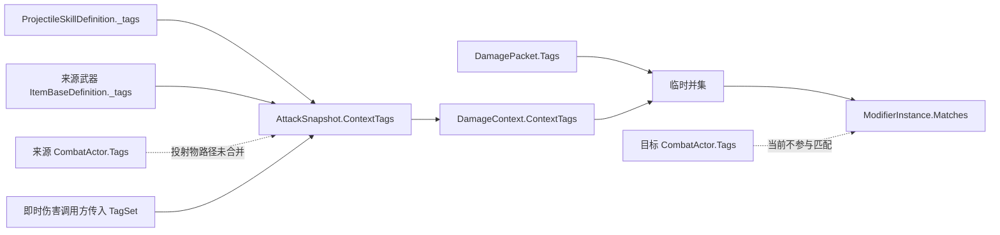

# 战斗标签使用规范与改进计划

> 状态：待实施
> 评估日期：2026-08-07
> 相关模块：[伤害系统与词条系统设计](../damage-affix-system.md)、[首批内容池](../content-system.md)、[装备系统](../equipment-system.md)

## 目标与边界

本文只讨论由 `TagDefinition`、`TagSet` 和相关查询组成的战斗标签，不包含 Unity GameObject Tag，也不讨论纯 UI 文本标签。

目标不是让更多对象拥有标签，而是为标签建立明确语义：

1. 说明哪些对象可以拥有标签、标签由谁生成、在哪个生命周期生效。
2. 说明哪些规则适合检测标签，哪些规则应继续使用类型、枚举或专用字段。
3. 评估当前 14 个标签的合理性、必要性与实际消费者。
4. 消除调用方随意拼接标签、同一事实重复配置、标签存在却不生效的问题。
5. 为后续 Buff、技能类型、怪物特征和条件词条提供可扩展但不过度设计的基础。

本计划不立即修改代码或配置资产。实施时应保持现有伤害、词条生成、打造和装备结果不变，再逐步迁移标签语义。

## 流放之路参考边界

本方案参考《流放之路》的标签分工与伤害转换语义，但不照搬其数据库规模和全部规则。

主要参考点：

1. 通用标签用于描述实体属性，并由后续系统决定物品词缀生成、打造或其他规则，而不是标签自身执行行为。[PoE Wiki：Tag](https://www.poewiki.net/wiki/Tag)
2. 技能宝石标签用于分类，但标签本身不等于技能一定能被某个辅助宝石支持，也不自动决定某条属性是否生效。[PoE Wiki：Skill gem](https://www.poewiki.net/wiki/Skill_gem)
3. 词缀的生成标签与词缀自身标签是两种职责：前者决定词缀能否在某种基底上生成，后者供定向打造、催化等规则识别；词缀组继续负责互斥。[PoE Wiki：Modifier](https://www.poewiki.net/wiki/Modifier)
4. 伤害转换后的伤害记住转换路径，能够受到路径上来源类型和当前类型的相关增伤，但防御只按最终伤害类型结算。[PoE Wiki：Damage conversion](https://www.poewiki.net/wiki/Damage_conversion)

本项目采用以下裁剪：

- 保留“标签描述语义、规则消费标签”的分工，不让标签直接授予行为。
- 区分物品生成标签、词缀标签和战斗上下文标签，避免用一套扁平字符串承担所有职责。
- 保留转换谱系思想，但用强类型伤害历史表达，不把伤害计算完全建立在字符串标签上。
- 当前没有辅助宝石、定向打造、区域标签和复杂怪物生态时，只建立边界与扩展点，不提前创建无消费者资产。

## 一、标签的使用原则

### 1. 标签应该表达什么

标签适合表达“可组合、可由数据驱动、会被多个规则作为条件查询的离散语义”。例如：

- 一个攻击是否属于投射物。
- 一个伤害是否具有物理来源。
- 一件物品是否属于某个可被词条池筛选的武器族系。
- 一个目标是否具有首领、不死、召唤物等可被多个效果查询的特征。

标签不保存数值，不表达唯一身份，也不替代对象之间的关系。

标签只描述“这个对象是什么或具有什么语义”。对象实际如何行动、技能是否兼容、修改器如何计算，仍由对应规则显式决定。例如 `projectile` 可以让投射物条件查询命中，但不能因为配置了该标签就自动创建投射物。

新增标签前必须回答：

1. **持有者是谁**：物品、技能、攻击、伤害包、来源角色还是目标角色。
2. **生产者是谁**：配置资产、类型字段派生、运行时状态还是攻击构建器。
3. **消费者是谁**：哪个词条、技能、AI 或规则会检测它。
4. **生命周期是什么**：永久配置、角色当前状态、攻击快照还是单个伤害包。
5. **是否已有更准确的字段**：若 `ItemType`、`EquipmentSlot`、`ActorTeam` 或 `DamageType` 已能完整回答，就不应再要求策划手动维护一份重复标签。

没有消费者的标签不应被当作“已使用”；最多只能标为预留，并由校验器给出提示。

### 2. 标签不应该替代什么

以下情况优先使用现有类型或专用字段：

| 业务问题 | 应使用 | 不应依赖 |
| --- | --- | --- |
| 物品能否装备到某个槽 | `ItemType`、`EquipmentSlotMask` | `weapon`、`armor`、`ring` 字符串 |
| 角色阵营与敌我判断 | `ActorTeam` | `monster` 标签 |
| 当前伤害采用哪种抗性 | `DamageType` | `fire`、`cold` 等标签 |
| 技能冷却、范围、伤害数值 | 专用数值字段 | 带值含义的字符串标签 |
| 物品、角色、技能的唯一身份 | 稳定 ID | 标签 |
| 词条互斥 | `GroupId` | 临时互斥标签 |

这些结构化字段可以派生出只读标签视图，供统一条件查询使用，但不应让内容作者重复配置两份事实。

### 3. 标签持有者、快照载体与查询者必须区分

- **持有者**定义长期语义，例如技能的投射物特征、角色的首领特征。
- **快照载体**只冻结已有语义，例如 `AttackSnapshot`、`DamageContext`，不应自行发明标签。
- **查询者**声明匹配条件，例如词条的必须、任一和禁止标签，不拥有被检测标签。
- **解析器**负责统一合并和派生，调用方不应在各 Controller、Command 中自行决定合并哪些集合。

## 二、当前实现与传播链

当前标签全部进入同一种扁平 `TagSet`，没有物品、攻击、伤害、来源角色和目标角色的作用域信息。



当前有三类检测：

1. `AffixDefinition.CanApplyTo` 使用物品标签筛选词条池。
2. `ModifierInstance.Matches` 使用攻击上下文与伤害包标签的并集筛选修改器。
3. `ContentConfigurationValidator` 直接使用字符串检查装备类别标签和怪物标签。

`StatAggregator` 也支持标签匹配，但当前正式调用固定传入 `TagSet.Empty`。因此带必须标签的普通属性修改器不会在静态属性聚合阶段生效；伤害修改器则由 `DamageCalculator` 单独处理。

## 三、当前哪些对象拥有标签

| 对象 | 配置或运行时字段 | 当前内容 | 实际用途 | 评估 |
| --- | --- | --- | --- | --- |
| `TagDefinition` | ID、中文名、说明 | 14 个资产 | 标签目录与显示信息 | 它是定义资产，不是被标记对象；缺少作用域和使用状态元数据 |
| `ItemBaseDefinition` | `_tags` / `RuntimeTags` | 武器、护甲、戒指及武器子类 | 词条生成、添加、打造时的物品兼容筛选；武器标签也进入投射物快照 | 有必要，但类别标签与 `ItemType`/槽位重复，`melee` 所属对象错误 |
| `ItemInstance` | `Tags` | 委托给基底标签 | 运行时词条兼容 | 合理的只读视图，不应另存副本 |
| `DamageRollDefinition` | `_tags` | 正式物理伤害均为 `damage + physical` | 创建 `DamagePacket`，供伤害修改器匹配 | 有必要保留伤害语义，但不应手工重复 `DamageType` |
| `ProjectileSkillDefinition` | `_tags` / `RuntimeTags` | `projectile` | 攻击快照的初始上下文 | 合理；攻击方式标签应由技能或攻击行为提供 |
| `MonsterDefinition` | `_tags` / `RuntimeTags` | `monster` | 配置到 `CombatActor`，用于怪物接触伤害上下文 | 当前无修改器消费，且与 `ActorTeam.Monster` 重复 |
| `CombatActor` | `_tags` / `Tags` | 怪物有 `monster`，玩家为空 | 即时怪物攻击把它作为上下文传入 | 作为运行时角色特征容器合理，但玩家/怪物路径不对称，投射物路径也不读取它 |
| `AttackSnapshot` | `ContextTags` | 技能标签，可并入武器标签或调用方标签 | 冻结攻击级条件 | 快照职责合理，但内容过于扁平且生产规则分散 |
| `DamagePacket` | `Tags` | `damage + physical` 或空 | 与攻击上下文临时合并后匹配修改器 | 合理，但转换和额外获得不会补充目标元素标签 |
| `DamageContext` | `ContextTags` | 复制攻击快照标签 | 伤害管线输入 | 合理的传输对象，但无法区分来源、目标和伤害作用域 |
| `AffixDefinition` | `_allowedItemTags` / `_blockedItemTags` | 12 个词条都有允许标签；禁止列表全空 | 物品兼容查询 | 查询需求合理，但与修改器使用两套不同字段和匹配语义 |
| `StatModifierDefinition` | `_requiredTags` / `_blockedTags` | 前四个攻击词条要求 `physical`；禁止列表全空 | 伤害阶段条件匹配 | 必要，但无法声明要查询技能、来源角色、目标角色还是伤害包 |

当前 `AffixDefinition` 只有“查询物品标签”的能力，没有“词缀自身标签”。因此 `flame_touched` 是火焰相关词缀这一事实目前只能从 ID、中文名和目标伤害类型推断，未来无法直接支持类似《流放之路》的“提高火焰词缀权重”或“不能生成攻击词缀”等定向打造规则。

## 四、哪些情况需要检测标签

### 1. 应当检测标签

| 场景 | 被检测对象 | 必要性 | 原因与约束 |
| --- | --- | --- | --- |
| 词条生成、掉落和打造兼容 | 物品语义标签 | 必要 | 允许一个词条适配多个可组合物品族系；应集中走同一查询对象 |
| 攻击者伤害修改器 | 技能、攻击、来源物品、伤害包 | 必要 | `projectile`、伤害来源等组合条件适合数据驱动 |
| 目标承伤修改器 | 入射攻击、伤害包、目标角色 | 必要但当前不完整 | 必须区分“攻击具有某标签”和“目标具有某标签” |
| Buff、状态和临时效果 | 角色当前状态或攻击临时标签 | 后续需要 | 只有在状态系统落地后才增加，且必须定义授予与移除生命周期 |
| 内容配置校验 | 标签定义、持有者和查询引用 | 必要 | 应发现无消费者、作用域错误、重复事实和永不可能匹配的查询 |
| 调试与测试 | 完整标签上下文和匹配结果 | 必要 | 标签是隐式条件，必须能解释一次修改器为何生效或未生效 |

### 2. 不应检测标签

- 装备槽验证继续使用 `EquipmentSlotMask`。
- 敌我与目标队伍继续使用 `ActorTeam`。
- 抗性、护甲和最终伤害分型继续使用 `DamageType` 与 `StatIds`。
- 角色、物品和技能查找继续使用稳定 ID 或对象引用。
- UI 排版与世界交互类别不应复用战斗标签。
- 仅有一个调用者且不会组合扩展的布尔状态，优先使用明确字段。

## 五、现有 14 个标签的合理性与必要性

| 标签 | 当前消费者 | 当前判断 | 改进决策 |
| --- | --- | --- | --- |
| `damage` | 没有独立消费者，只随伤害包传播 | 作为 `DamagePacket` 的通用事实是冗余的 | 若保留，改为所有伤害包自动派生；没有通用伤害查询前不要求手工配置 |
| `weapon` | 5 个词条的物品兼容查询 | 查询有价值，但与 `ItemType.Weapon` 重复 | 从 `ItemType`/装备槽自动派生，移除资产上的手工维护责任 |
| `armor` | 7 个词条的物品兼容查询 | 同上 | 从 `ItemType.Armor` 自动派生 |
| `ring` | 9 个词条的物品兼容查询 | 与 `ItemType.Accessory` 和戒指槽重复，名称还比类型更具体 | 从允许戒指槽自动派生，或让词条查询直接支持槽位；不要手工同步 |
| `sword` | 无 | 当前只是内容分类，没有实际规则 | 标为未消费；只有出现剑限定词条/技能后才启用，否则移除 |
| `axe` | 无 | 同上 | 同 `sword` |
| `physical` | 前四个攻击词条；伤害计算 | 必要，但与 `DamageType.Physical` 重复配置 | 由伤害类型自动派生；物理来源转换后保留该来源语义 |
| `fire` | 无标签消费者 | 已定义但未进入正式伤害标签 | 由火焰伤害类型自动派生；只有查询出现后才视为活跃 |
| `cold` | 无标签消费者 | 同上 | 由冰霜伤害类型自动派生 |
| `lightning` | 无标签消费者 | 同上 | 由闪电伤害类型自动派生 |
| `chaos` | 无标签消费者 | 同上 | 由混沌伤害类型自动派生 |
| `projectile` | 技能攻击上下文 | 合理且必要 | 保留在技能/攻击方式作用域，不放到武器或角色上 |
| `melee` | 无；目前配置在两把武器上 | 语义合理但持有者错误；武器可以被投掷，技能才决定本次攻击方式 | 从武器移除，未来配置在近战技能或攻击构建规则上 |
| `monster` | 校验器和怪物接触伤害上下文，无修改器消费 | 与 `ActorTeam.Monster` 重复，且玩家没有对称标签 | 当前不作为手工标签；需要角色条件查询时从 `ActorTeam` 派生，并同时定义玩家语义 |

由此可分为四类：

- **当前活跃且语义正确**：`projectile`。
- **当前活跃但应自动派生**：`weapon`、`armor`、`ring`、`physical`。
- **语义合理但所有权或消费者不完整**：`melee`、`monster`、四种元素标签。
- **当前没有必要性证据**：`damage`、`sword`、`axe`。

## 六、主要问题

### 1. 所有作用域被压成一个集合

当前 `ModifierInstance.Matches(TagSet)` 无法表达以下差异：

- 来源角色是怪物。
- 目标角色是怪物。
- 技能是投射物。
- 来源武器是剑。
- 当前伤害是火焰。
- 当前火焰伤害由物理转换而来。

一旦增加目标限定或转换后元素限定词条，同一个字符串并集会产生误匹配或无法匹配。

### 2. 标签生产规则分散

- 投射物由 `AttackSnapshotFactory` 合并技能与武器标签，但不合并攻击者标签。
- 怪物接触伤害由 `MonsterController` 直接把 `_actor.Tags` 当作完整上下文。
- 其他即时伤害由调用方任意传入 `TagSet`。

这使新增攻击入口时很容易漏标签，而且调用方无法知道哪些集合属于标准规则。

### 3. 结构化事实被重复手工配置

物品类别、阵营和伤害类型已经分别由 `ItemType`、`ActorTeam`、`DamageType` 表达。当前配置还要求重复填写对应标签，任何一边修改都可能造成漂移。

### 4. 伤害转换没有补充目标元素语义

转换和额外获得创建新 `DamagePacket` 时沿用原包标签。物理获得额外火焰仍只有 `damage + physical`，因此未来要求 `fire` 的修改器不会匹配；另一方面，保留 `physical` 对“由物理转化而来”的缩放又是有价值的。

参考《流放之路》的转换语义，需要保留来源类型与转换路径，同时让防御只读取最终 `DamageType`。谱系本身应使用强类型伤害历史保存，再按需派生查询标签；不能继续仅靠一个通用 `TagSet` 猜测当前类型和来源类型。

### 5. 查询模型重复且能力不一致

- 词条适配使用“允许任一 + 禁止任一”。
- 修改器使用“必须全部 + 禁止任一”。
- 没有统一的“必须任一”。
- 查询没有作用域。

这些差异分散在 `AffixDefinition` 与 `ModifierInstance` 中，后续扩展容易产生第三套语义。

### 6. 校验器固定数量，不校验使用质量

当前校验器硬编码 14 个预期 ID 和数量，能检查缺失与重复，但不能检查：

- 标签是否有消费者。
- 标签是否放在允许的对象类型上。
- 查询是否永远不可能匹配。
- `DamageType` 与手工伤害标签是否冲突。
- 物品类别、阵营与重复标签是否一致。

### 7. 条件属性聚合缺少明确边界

`StatAggregator` 支持标签查询，但正式角色属性重建传入空标签。当前应明确二选一：

- 静态角色属性禁止使用标签条件，条件伤害统一留在伤害管线；或
- 为属性聚合提供明确的角色状态上下文。

首版建议选择前者，避免装备属性在无攻击上下文时出现含糊条件。

## 七、目标结构

### 1. 建立标签作用域

建议为 `TagDefinition` 增加 `CombatTagDomain`：

```text
ItemSpawn
Modifier
Actor
Skill
Attack
Damage
```

作用域含义：

- `ItemSpawn`：描述物品基底可供词缀生成系统查询的属性，例如武器、戒指、剑。
- `Modifier`：描述词缀自身属于哪类效果，例如火焰、生命、攻击、抗性，供未来定向打造查询。
- `Actor`：描述角色可被战斗规则查询的特征，例如首领、不死、召唤物。
- `Skill`：描述技能定义的分类，例如投射物、近战、范围。
- `Attack`：描述本次攻击动态获得的语义，例如被强化、重复、反击。
- `Damage`：描述单个伤害分量的来源与转换谱系。

稳定 ID 第一阶段不重命名，先通过 Domain 限制引用位置并保持现有资产 GUID。现有 `physical` 迁移为 `Damage` Domain 后，物品不再引用它；如果未来需要标记“物理词缀”，应新建 `modifier_physical`，不能跨 Domain 复用同一资产。新的跨域同名概念继续遵守小写 `snake_case`，使用 `modifier_`、`skill_` 等前缀消除歧义。

### 2. 区分配置标签与派生标签

| 来源 | 示例 | 维护方式 |
| --- | --- | --- |
| 内容作者配置 | 技能 `projectile`、角色 `boss`、武器族系 `sword` | `TagDefinition` 引用 |
| 类型自动派生 | `ItemType.Weapon -> weapon` | 中央解析器生成，Inspector 不重复填写 |
| 伤害自动派生 | `DamageType.Fire -> fire` | 从强类型伤害谱系派生，Inspector 不重复填写 |
| 运行时状态授予 | `burning`、`fortified` | 未来状态系统负责添加、移除和取消 |

内建派生标签应集中到 `CombatTagIds` 常量和映射工具中；可扩展内容标签继续使用资产。不要把所有设计标签改成枚举。

### 3. 用结构化上下文替代扁平并集

建议引入不可变的 `CombatTagContext`：

```text
SourceActorTags
TargetActorTags
SkillTags
SourceItemTags
AttackTags
DamageTags
```

- `AttackSnapshot` 冻结来源角色、技能、来源物品和本次攻击标签；目标集合在命中前为空，伤害集合由各 `DamagePacket` 提供。
- 命中时由 `CombatSystem` 加入 `TargetActorTags`。
- 每个 `DamagePacket` 提供自己的 `DamageTags`。
- 只有查询器可以按声明的作用域读取集合；业务调用方不再直接构造大并集。

### 4. 分离词缀生成标签与词缀自身标签

参考《流放之路》的 modifier spawn tag / mod tag 分工，`AffixDefinition` 目标结构应拆为：

```text
SpawnQuery
ModifierTags
GroupId
Weight
Modifiers
```

- `SpawnQuery` 只查询 `ItemSpawn` Domain，决定词缀是否能进入当前物品候选池。
- `ModifierTags` 标记词缀自身语义，只有定向打造、权重调整或“不能生成某类词缀”等消费者出现时才配置。
- `GroupId` 继续负责互斥，不能用 `ModifierTags` 代替。
- `StatModifierDefinition` 的战斗条件仍是 Combat Query，不等于 `ModifierTags`。

当前内容迁移时只建立结构，不必立刻为 12 个词缀补齐 `ModifierTags`；没有定向打造消费者前，这些标签应保持为空或明确标为预留。

### 5. 统一标签查询模型

建议用一个可序列化 `TagQueryDefinition` 表达：

```text
ScopeMask
RequiredAll
RequiredAny
BlockedAny
```

匹配顺序固定为：

1. 选择 `ScopeMask` 指定的标签集合。
2. `RequiredAll` 必须全部存在。
3. `RequiredAny` 非空时至少存在一个。
4. `BlockedAny` 任意存在即失败。

迁移关系：

- `AffixDefinition.AllowedItemTags` -> `ItemSpawn` 作用域的 `RequiredAny`。
- `AffixDefinition.BlockedItemTags` -> `ItemSpawn` 作用域的 `BlockedAny`。
- 修改器现有 `RequiredTags` -> 对应作用域的 `RequiredAll`。
- 修改器现有 `BlockedTags` -> 对应作用域的 `BlockedAny`。

物品兼容和战斗修改器可以共用纯逻辑匹配器，但保留各自的业务入口，避免数据层直接依赖战斗 Controller。

### 6. 集中构建标签上下文

增加纯逻辑 `CombatTagContextBuilder` 或 `CombatTagResolver`：

- 投射物与即时攻击都通过同一入口生成 `AttackSnapshot`。
- 明确是否加入来源角色、技能、来源物品和临时攻击标签。
- `MonsterController` 不再自行决定把哪个 `TagSet` 传入 Command。
- `ApplyDamageCommand` 接受已构建快照或结构化攻击参数，不接受意义不明的裸 `TagSet contextTags`。

该组件适合作为无状态 Utility，不需要新增 QFramework System。

### 7. 用强类型记录伤害转换谱系

`DamagePacket` 目标上应明确区分：

```text
CurrentType
ScalingTypes
CustomTags
```

- `CurrentType` 是当前最终伤害类型，决定护甲、抗性和承伤结算。
- `ScalingTypes` 使用 `DamageTypeMask` 或等价强类型集合记录转换历史。
- `CustomTags` 只保存不能由伤害类型推导的额外语义。
- 面向数据查询时，由 Resolver 将 `ScalingTypes` 映射为 Damage Domain 标签。

首版谱系规则：

- 初始物理包：`CurrentType = Physical`，`ScalingTypes = Physical`。
- 物理转火焰包：`CurrentType = Fire`，`ScalingTypes = Physical | Fire`。
- 物理额外获得冰霜包：`CurrentType = Cold`，`ScalingTypes = Physical | Cold`。
- 同一个修改器即使同时命中谱系中的多个类型，也只能应用一次。
- Gain as Extra 保留来源伤害，Conversion 从来源伤害中移除对应比例。
- 当前多重转换仍沿用总量封顶 100%；真正加入链式转换内容时，再实现并测试 `Physical -> Lightning -> Cold -> Fire -> Chaos` 顺序和技能来源优先级。

通用 `damage` 若继续保留，由 `DamagePacket` 自动加入，不再出现在每个资产的 `_tags` 列表中。

## 八、实施计划

### 阶段 1：冻结语义并补足基线测试

1. 为 `TagSet`、`ModifierInstance.Matches` 和 `AffixDefinition.CanApplyTo` 增加直接单元测试。
2. 记录现有七件装备的兼容词条集合和正式攻击结果，作为迁移回归基线。
3. 增加测试证明当前缺口：来源/目标 Actor 标签不可区分、投射物不含 Actor 标签、转换包没有目标元素标签。

验收标准：新增测试能稳定描述现状，且不修改正式内容结果。

### 阶段 2：引入 Domain、统一查询和结构化上下文

1. 为 `TagDefinition` 增加 Domain，并迁移 14 个资产到 `ItemSpawn`、`Actor`、`Skill` 或 `Damage`。
2. 新增 `TagQueryDefinition` 与纯逻辑匹配器。
3. 新增不可变 `CombatTagContext`，保留旧 `TagSet` 接口作为短期适配层。
4. 为 `AffixDefinition` 分离 `SpawnQuery` 与预留的 `ModifierTags`。
5. 给配置中心增加 Domain 展示和错误引用提示。

验收标准：新旧查询对当前正式词条给出相同结果，旧资产 GUID 不变。

### 阶段 3：集中攻击上下文与伤害标签生成

1. 让投射物和即时攻击统一经由标签上下文构建器。
2. 将来源角色、目标角色、技能、来源物品、攻击和伤害包作用域分开。
3. 为 `DamagePacket` 增加强类型 `ScalingTypes`，并从中派生伤害标签。
4. 转换和额外获得伤害采用来源历史与最终类型分离的谱系规则。
5. 移除 Controller 和 Command 对裸上下文标签的自由拼接。

验收标准：当前 `physical` 词条效果不变；新的 `fire`/`cold` 查询能命中转换或额外伤害；每个修改器只应用一次；来源与目标角色条件互不混淆。

### 阶段 4：清理资产责任

1. 从物品资产移除可由 `ItemType`/槽位派生的 `weapon`、`armor`、`ring`。
2. 从武器资产移除 `melee`，改由近战技能或攻击方式提供。
3. 从伤害配置移除由 `DamageType` 派生的类型标签和通用 `damage`。
4. `monster` 改由 `ActorTeam` 派生，或在没有消费者时暂时停用。
5. 对 `sword`、`axe` 做内容决策：增加实际消费者，或删除未使用引用和定义。
6. 不为 `AffixDefinition.ModifierTags` 批量造数据；先等待定向打造规则成为真实消费者。

验收标准：内容作者只维护不可从结构化字段推导的标签；所有活跃标签至少有一个正式消费者。

### 阶段 5：增强校验、调试和文档

1. 校验 Domain 与持有者/查询 Scope 是否匹配。
2. 报告无持有者、无消费者、永不可能匹配和重复派生的标签。
3. 提供一次伤害的标签上下文与查询失败原因 Debug 输出，默认仅在开发或显式开关下启用。
4. 更新 `damage-affix-system.md`、`content-system.md` 和相关配置中心说明。
5. 完成后将本文总结为模块文档，并归档到 `Docs/docs/plan/archive/`。

验收标准：配置中心扫描为零错误；活跃标签可追溯到持有者和消费者；文档与实现一致。

## 九、测试与验收清单

### 纯逻辑测试

- 空标签、重复标签、空引用和稳定 ID 比较。
- `RequiredAll`、`RequiredAny`、`BlockedAny` 的组合边界。
- 查询只读取声明的作用域。
- 物品兼容迁移前后候选词条集合一致。
- 物理转火焰同时匹配 `physical` 和 `fire`。
- 物理额外获得冰霜同时匹配 `physical` 和 `cold`。
- 同一个修改器不会因为同时匹配多个转换历史类型而重复应用。
- `SpawnQuery`、`ModifierTags` 和战斗条件查询不会跨 Domain 误用。
- 来源怪物与目标怪物条件不会互相误判。
- 投射物与近战由攻击方式决定，不由武器类别隐式决定。

### 集成测试

- 玩家有武器和空手时的投射物伤害与迁移前一致。
- 三种怪物接触伤害与掉落结果保持固定种子可重放。
- 打造、掉落和直接添加词条都使用同一物品标签查询。
- 在途投射物继续冻结发射时的来源标签和修改器。
- 目标在命中前改变状态时，只更新明确规定为命中时读取的目标标签。

### 配置验收

- 每个标签有明确 Domain、持有者、生产方式和至少一个消费者，预留标签除外。
- 预留标签有显式状态，不计入“正式活跃标签”数量。
- 不存在手工配置且可由类型字段派生的标签。
- 不存在跨 Domain 引用和永不可能命中的查询。
- Runtime、Editor、EditMode 和 PlayMode 程序集编译无错误。

## 十、成功标准

计划完成后，项目应满足：

1. 看到任意标签引用时，可以明确回答“它描述哪个对象、由谁产生、何时有效、谁会检测”。
2. 新增攻击入口不需要调用方自行拼接裸 `TagSet`。
3. 物品类别、阵营和伤害类型只维护一个权威字段，标签由统一规则派生。
4. 标签查询能够区分来源角色、目标角色、技能、物品、攻击和伤害包。
5. 物品词缀生成标签、词缀自身标签和战斗条件标签职责分离。
6. 伤害转换以强类型历史保留来源谱系，并获得目标元素语义。
7. 配置中心能发现未使用、错作用域和不可能匹配的标签。
8. 当前正式词条、装备、技能和怪物行为没有非预期数值变化。

## 十一、非目标

- 本阶段不为标签实现 DOTS、位图压缩或全局整数注册表；当前内容量下 `HashSet<string>` 足够，先解决语义正确性。
- 不预先创建 Buff、异常状态、首领、召唤物等尚无消费者的标签资产。
- 不用标签替代 `ItemType`、`EquipmentSlot`、`ActorTeam`、`DamageType`、`StatIds` 或稳定 ID。
- 不在这次整理中扩展未实现的暴击率、命中、闪避、触发器和状态系统。
