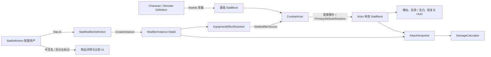

# 属性定义与调用关系

状态阶段 3 新增七项异常抗性及属性说明，统一按 0–100% 裁剪；正式属性目录与 HUD 已接入。完整行为见[异常与来源](./status-ailments.md)。

## 模块边界

`StatDefinition` 是配置和显示元数据，保存稳定 ID、中文名、类别、默认值、范围和百分比标记。运行时计算只使用字符串稳定 ID，不会持有 `StatDefinition`，也不会自动读取其默认值或按最小值、最大值裁剪。

`StatIds` 是运行时唯一允许使用的 ID 清单。所有属性资产必须与 `StatIds.All` 一一对应，并统一使用小写 `snake_case`。

## 调用关系

装备来源遍历完整十槽 Loadout，以 `EquipmentSlots.GetKey` 解析部位本地化；头部、手部、腿部、副手、项链和腰带与旧槽共同聚合。副手不引入第二份武器基础伤害。详情、HUD 和保存恢复均读取同一最终属性，穿脱时继续保持生命 / 法力比例。

具体过程如下：

1. `CharacterDefinition.CreateStats` 和 `MonsterDefinition.CreateStats` 使用 `StatIds` 创建角色基础 `StatBlock`。
2. 物品基底和词条通过 `StatModifierDefinition` 引用 `StatDefinition`；生成实例时只把 `StatDefinition.Id` 复制到 `ModifierInstance.StatId`。
3. 换装后，`EquipmentEffectResolver` 更新 `equipment` 来源；怪物实例词条更新 `monster` 来源；状态参与者更新 `status` 来源。`CombatActor.SetModifierSource` 按稳定来源排序汇总，并通过 `CombatStatResolver` 从基础属性重建。旧 SetModifiers 仅管理兼容来源。规则见[状态战斗接入](./status-combat.md)。
4. 非伤害类 `GlobalActor` 修改器先由 `StatAggregator` 处理 `Flat`、`Increase`、`More` 和 `Override`，再由 `PrimaryAttributeResolver` 按聚合后的力量、敏捷和智力派生最终属性。伤害类属性仍由 `DamageCalculator` 单独处理，避免在聚合层和伤害管线重复应用。
5. `CombatActor` 保存当前生命与当前法力；`CombatSystem` 统一提交伤害、治疗、法力消耗和恢复，`ResourceRegenerationSystem` 按有效恢复属性推进被动恢复。
6. 攻击发起时，`AttackSnapshotFactory` 冻结攻击者属性、修改器和具名随机子流；命中时 `HitResolutionCalculator` 读取目标闪避，再由 `DamageCalculator` 计算类型伤害、暴击、护甲和抗性。
7. `ItemDetailSnapshotFactory` 从原始 `StatDefinition` 读取中文名和百分比标记，再交给 `ItemDetailFormatter` 生成背包、商店和打造 UI 文本。

背包只保留力量、敏捷、智力摘要，标题栏与 HUD 可打开[独立属性详情](./attribute-details.md)。`GetAttributeDetailsQuery` 提供基础值、正式解析步骤、有效值、装备来源和条件；伤害类修改器在攻击 / 修改器分组解释，不伪装成直接聚合属性。`HudAttributeSnapshot.Values` 仍按 `StatIds.All` 提供有序快照，显示有效值与详情共用 `CombatStatValues`，抗性与暴击边界沿用正式消费者。

## 当前属性清单

| 分组 | 稳定 ID | 中文名 | 当前运行时用途 |
| --- | --- | --- | --- |
| 生存 | `max_health` | 最大生命 | `CombatActor.MaxHealth`、当前生命比例和 HUD |
| 生存 | `mana` | 最大法力 | `CombatActor.MaxMana`、当前法力比例、技能耗蓝和 HUD |
| 生存 | `health_regeneration` | 生命恢复 | 每秒固定生命恢复，由 `ResourceRegenerationSystem` 消费 |
| 生存 | `mana_regeneration` | 法力恢复 | 在基础恢复之外追加的每秒固定值；实际总恢复由 `ResourceRegenerationSystem` 计算 |
| 基础 | `strength` | 力量 | 每 1 点派生 2 点最大生命 |
| 基础 | `dexterity` | 敏捷 | 每 1 点派生 1 点命中和 1 点闪避 |
| 基础 | `intelligence` | 智力 | 每 1 点派生 2 点最大法力 |
| 通用伤害 | `damage` | 伤害 | 修改器匹配所有伤害类型 |
| 类型伤害 | `physical_damage` | 物理伤害 | 物理伤害包的固定值和增伤匹配 |
| 类型伤害 | `fire_damage` | 火焰伤害 | 火焰伤害包的固定值和增伤匹配 |
| 类型伤害 | `cold_damage` | 冰霜伤害 | 冰霜伤害包的固定值和增伤匹配 |
| 类型伤害 | `lightning_damage` | 闪电伤害 | 闪电伤害包的固定值和增伤匹配 |
| 类型伤害 | `chaos_damage` | 混沌伤害 | 混沌伤害包的固定值和增伤匹配 |
| 暴击 | `critical_chance` | 暴击率 | 每次命中攻击使用独立 `CriticalRoll` 判定，范围裁剪到 `0–100%` |
| 暴击 | `critical_damage` | 暴击伤害 | 暴击时作为额外伤害百分比；`50` 表示最终 `150%` |
| 命中 | `accuracy` | 命中值 | 与目标闪避共同计算 `5–95%` 命中率 |
| 防御 | `armor` | 护甲 | 降低物理命中伤害 |
| 防御 | `evasion` | 闪避值 | 命中失败时区分目标闪避与自然未命中 |
| 防御 | `fire_resistance` | 火焰抗性 | 火焰伤害减免，当前有效范围 `-100%` 至 `75%` |
| 防御 | `cold_resistance` | 冰霜抗性 | 冰霜伤害减免，当前有效范围 `-100%` 至 `75%` |
| 防御 | `lightning_resistance` | 闪电抗性 | 闪电伤害减免，当前有效范围 `-100%` 至 `75%` |
| 防御 | `chaos_resistance` | 混沌抗性 | 混沌伤害减免，当前有效范围 `-100%` 至 `75%` |
| 移动 | `move_speed` | 移动速度 | 玩家和怪物移动控制器直接读取 |

## 数值语义

- 主属性处理顺序固定为“基础属性 → 非伤害 `GlobalActor` 直接修改器 → 主属性派生 → 最终属性”。派生常量集中在 `PrimaryAttributeResolver`，UI 和 Controller 不重复实现公式。
- 每次有效属性重建都从 `CombatActor` 保存的基础属性重新开始；`PrimaryAttributeResolver` 返回新 `StatBlock`，不会修改直接聚合结果或把上次派生值再次作为输入。
- 初版力量不派生伤害或护甲，敏捷不派生移动速度或暴击，智力不派生元素伤害或恢复。
- `StatDefinition.IsPercent` 只影响配置说明和 UI 格式，不决定修改器算法。
- `ModifierOperation.Flat` 使用直接数值；`Increase` 使用同类加算百分比；`More` 使用逐项独立乘算；`Override` 覆盖当前值。
- `critical_damage` 保存的是额外百分比，不是最终倍率，因此默认值为 `0`。
- `mana` 沿用稳定 ID，但语义固定为最大法力；当前法力是 `CombatActor` 运行时状态，不是另一项属性。
- 基础法力恢复固定为最大法力的 `5%/秒`；`mana_regeneration` 保持每秒固定加成语义。实际法力恢复为 `MaxMana × 0.05 + max(0, mana_regeneration)`，再乘以实际推进的游戏时间。属性面板显示该最终每秒值。
- `health_regeneration` 仍是每秒固定值，恢复量为属性值乘以实际推进的游戏时间。
- 当前生命和法力始终裁剪到 `0..Max`。有效上限变化时保持原比例；旧法力上限为零而新上限大于零时初始化为满法力，新上限为零时当前法力归零。
- 配置完成与复活将生命、法力恢复到当前有效上限；死亡、禁用、注销和菜单暂停期间不推进被动恢复。
- 命中率为 `clamp(accuracy / (accuracy + evasion), 0.05, 0.95)`；命中值不大于 0 时使用最低 5%。
- 暴击率按百分比裁剪到 `0–100%`；只有命中攻击可暴击，同一攻击的所有伤害类型共享一次暴击结论。
- 抗性资产范围与当前伤害公式一致；`DamageCalculator` 仍会在结算时执行最终裁剪。
- `StatDefinition.DefaultValue`、`MinValue` 和 `MaxValue` 不会自动注入或裁剪 `StatBlock`。角色基础值仍由角色/怪物配置写入，最终公式仍需在消费者处保证边界。

## 配置校验

`StatConfigurationValidator` 提供两层校验：

- 单资产：稳定 ID 非空、使用小写 `snake_case`、已登记到 `StatIds`、中文名非空、默认值和范围有效。
- 完整集合：额外检查重复 ID，以及 `StatIds.All` 是否缺少对应 `StatDefinition` 资产。

`StatDefinition.OnValidate` 会在 Inspector 修改时输出单资产 Warning；EditMode 测试会扫描 `Assets/Data/Preset/Stats`，保证当前 23 个运行时 ID 与 23 个配置资产一一对应。

属性专项测试覆盖完整资产集合、主属性派生顺序、重复重建、资源比例保持、命中 / 闪避边界、暴击伤害百分比语义和非法配置诊断。

新增属性时必须同步完成：

1. 在 `StatIds` 添加稳定 ID，并加入 `StatIds.All`。
2. 在 `Assets/Data/Preset/Stats` 创建同 ID 的 `StatDefinition`。
3. 明确它属于通用聚合、伤害管线还是具体系统直接读取。
4. 补充对应公式测试或明确标注为“已登记、尚未接入”。

伤害计算顺序和修改器 Scope 见[伤害系统与词条系统设计](./damage-affix-system.md)，装备效果重建见[装备系统](./equipment-system.md)。
