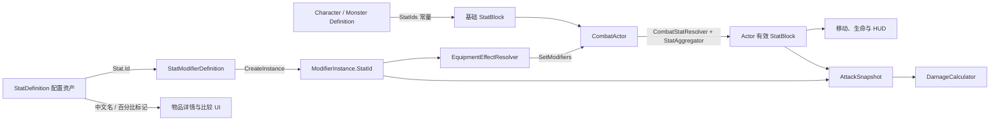

# 属性定义与调用关系

## 模块边界

`StatDefinition` 是配置和显示元数据，保存稳定 ID、中文名、类别、默认值、范围和百分比标记。运行时计算只使用字符串稳定 ID，不会持有 `StatDefinition`，也不会自动读取其默认值或按最小值、最大值裁剪。

`StatIds` 是运行时唯一允许使用的 ID 清单。所有属性资产必须与 `StatIds.All` 一一对应，并统一使用小写 `snake_case`。

## 调用关系

具体过程如下：

1. `CharacterDefinition.CreateStats` 和 `MonsterDefinition.CreateStats` 使用 `StatIds` 创建角色基础 `StatBlock`。
2. 物品基底和词条通过 `StatModifierDefinition` 引用 `StatDefinition`；生成实例时只把 `StatDefinition.Id` 复制到 `ModifierInstance.StatId`。
3. 换装后，`EquipmentEffectResolver` 从完整 Loadout 收集修改器，`CombatActor.SetModifiers` 通过 `CombatStatResolver` 和 `StatAggregator` 重建有效属性。
4. 非伤害类 `GlobalActor` 修改器在属性聚合层处理 `Flat`、`Increase`、`More` 和 `Override`。伤害类属性由 `DamageCalculator` 单独处理，避免在聚合层和伤害管线重复应用。
5. 攻击发起时，`AttackSnapshotFactory` 冻结攻击者属性、修改器和具名随机子流；命中时 `HitResolutionCalculator` 读取目标闪避，再由 `DamageCalculator` 计算类型伤害、暴击、护甲和抗性。
6. `ItemDetailSnapshotFactory` 从原始 `StatDefinition` 读取中文名和百分比标记，再交给 `ItemDetailFormatter` 生成背包、商店和打造 UI 文本。

背包右侧的当前属性卡不再维护局部白名单。`HudAttributeSnapshot.Values` 按 `StatIds.All` 生成完整、有序的显示快照，当前 21 项全部可见；抗性沿用伤害结算边界，其他百分比语义与 `StatDefinition` 保持一致。

## 当前属性清单

| 分组 | 稳定 ID | 中文名 | 当前运行时用途 |
| --- | --- | --- | --- |
| 生存 | `max_health` | 最大生命 | `CombatActor.MaxHealth`、当前生命比例和 HUD |
| 生存 | `mana` | 魔力 | 已登记，可参与通用聚合；资源消耗流程尚未接入 |
| 基础 | `strength` | 力量 | 已登记，可参与通用聚合；派生规则尚未接入 |
| 基础 | `dexterity` | 敏捷 | 已登记，可参与通用聚合；派生规则尚未接入 |
| 基础 | `intelligence` | 智力 | 已登记，可参与通用聚合；派生规则尚未接入 |
| 通用伤害 | `damage` | 伤害 | 修改器匹配所有伤害类型 |
| 类型伤害 | `physical_damage` | 物理伤害 | 物理伤害包的固定值和增伤匹配 |
| 类型伤害 | `fire_damage` | 火焰伤害 | 火焰伤害包的固定值和增伤匹配 |
| 类型伤害 | `cold_damage` | 冰霜伤害 | 冰霜伤害包的固定值和增伤匹配 |
| 类型伤害 | `lightning_damage` | 闪电伤害 | 闪电伤害包的固定值和增伤匹配 |
| 类型伤害 | `chaos_damage` | 混沌伤害 | 混沌伤害包的固定值和增伤匹配 |
| 暴击 | `critical_chance` | 暴击率 | 每次命中攻击使用独立 `CriticalRoll` 判定，范围裁剪到 `0–100%` |
| 暴击 | `critical_damage` | 暴击伤害 | 暴击时作为额外伤害百分比；`50` 表示最终 `150%` |
| 命中 | `accuracy` | 命中值 | 与目标闪避共同计算 `5–95%` 命中率 |
| 防御 | `armor` | 护甲 | 降低物理命中伤害 |
| 防御 | `evasion` | 闪避值 | 命中失败时区分目标闪避与自然未命中 |
| 防御 | `fire_resistance` | 火焰抗性 | 火焰伤害减免，当前有效范围 `-100%` 至 `75%` |
| 防御 | `cold_resistance` | 冰霜抗性 | 冰霜伤害减免，当前有效范围 `-100%` 至 `75%` |
| 防御 | `lightning_resistance` | 闪电抗性 | 闪电伤害减免，当前有效范围 `-100%` 至 `75%` |
| 防御 | `chaos_resistance` | 混沌抗性 | 混沌伤害减免，当前有效范围 `-100%` 至 `75%` |
| 移动 | `move_speed` | 移动速度 | 玩家和怪物移动控制器直接读取 |

## 数值语义

- `StatDefinition.IsPercent` 只影响配置说明和 UI 格式，不决定修改器算法。
- `ModifierOperation.Flat` 使用直接数值；`Increase` 使用同类加算百分比；`More` 使用逐项独立乘算；`Override` 覆盖当前值。
- `critical_damage` 保存的是额外百分比，不是最终倍率，因此默认值为 `0`。
- 命中率为 `clamp(accuracy / (accuracy + evasion), 0.05, 0.95)`；命中值不大于 0 时使用最低 5%。
- 暴击率按百分比裁剪到 `0–100%`；只有命中攻击可暴击，同一攻击的所有伤害类型共享一次暴击结论。
- 抗性资产范围与当前伤害公式一致；`DamageCalculator` 仍会在结算时执行最终裁剪。
- `StatDefinition.DefaultValue`、`MinValue` 和 `MaxValue` 不会自动注入或裁剪 `StatBlock`。角色基础值仍由角色/怪物配置写入，最终公式仍需在消费者处保证边界。

## 配置校验

`StatConfigurationValidator` 提供两层校验：

- 单资产：稳定 ID 非空、使用小写 `snake_case`、已登记到 `StatIds`、中文名非空、默认值和范围有效。
- 完整集合：额外检查重复 ID，以及 `StatIds.All` 是否缺少对应 `StatDefinition` 资产。

`StatDefinition.OnValidate` 会在 Inspector 修改时输出单资产 Warning；EditMode 测试会扫描 `Assets/Data/Preset/Stats`，保证当前 21 个运行时 ID 与 21 个配置资产一一对应。

属性专项测试覆盖完整资产集合、命中 / 闪避边界、暴击伤害百分比语义和非法配置诊断。

新增属性时必须同步完成：

1. 在 `StatIds` 添加稳定 ID，并加入 `StatIds.All`。
2. 在 `Assets/Data/Preset/Stats` 创建同 ID 的 `StatDefinition`。
3. 明确它属于通用聚合、伤害管线还是具体系统直接读取。
4. 补充对应公式测试或明确标注为“已登记、尚未接入”。

伤害计算顺序和修改器 Scope 见[伤害系统与词条系统设计](./damage-affix-system.md)，装备效果重建见[装备系统](./equipment-system.md)。
